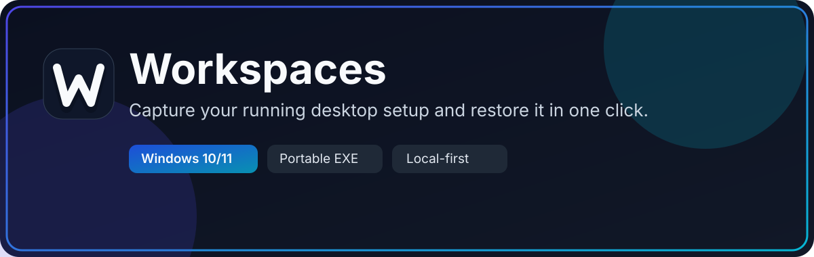
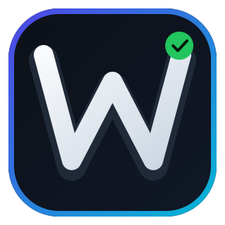
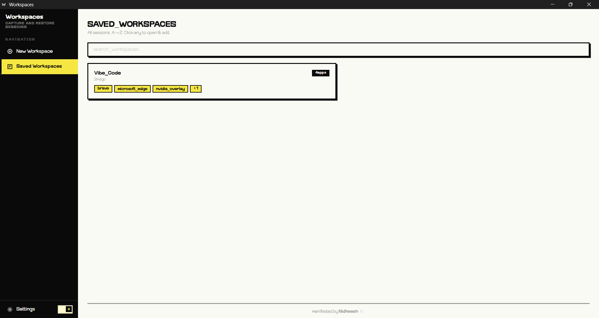
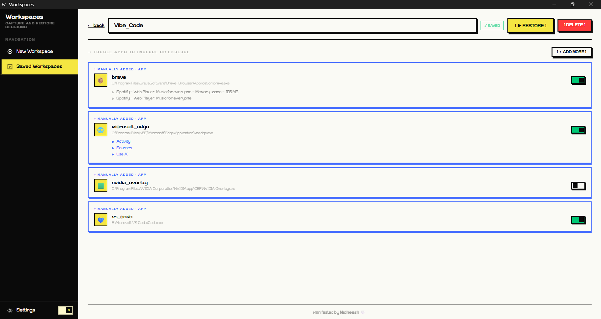
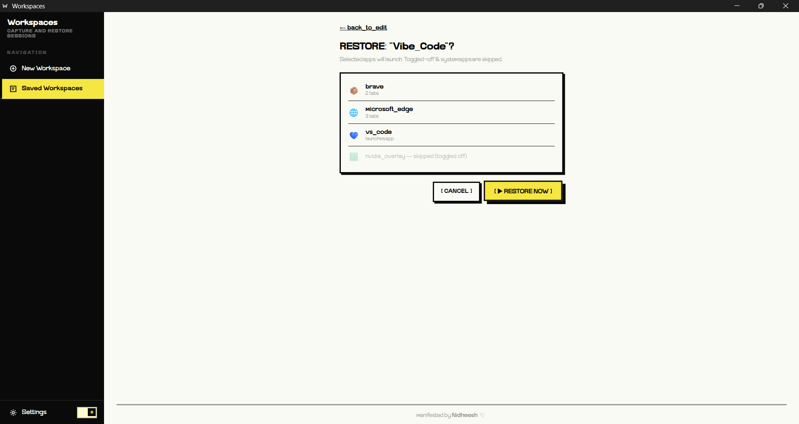
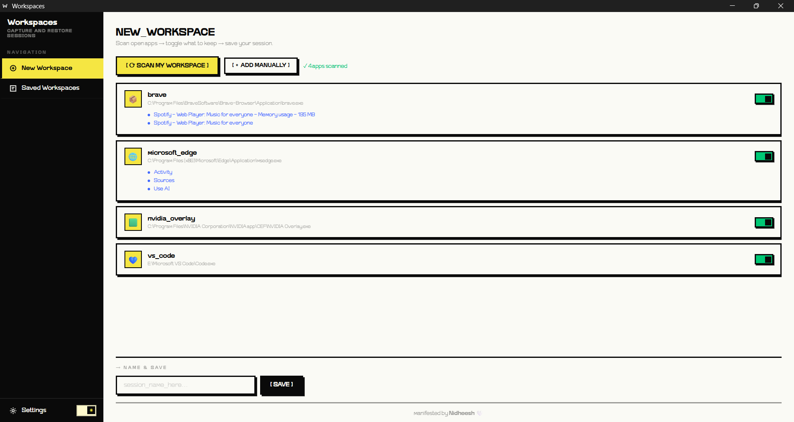
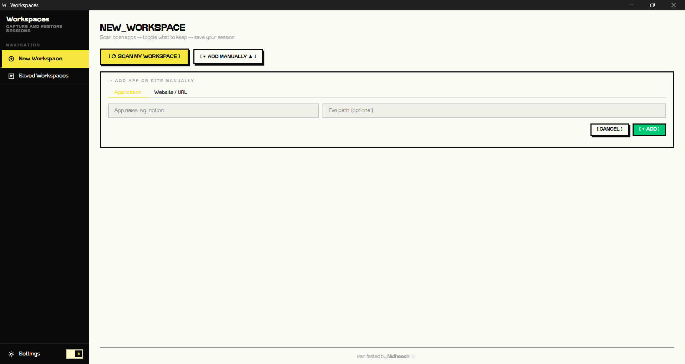

# Workspaces

<p align="center">
  
</p>

<p align="center">
  <a href="../../releases/latest"></a>
  
  
  
  
</p>

<p align="center">
  
</p>

### Save and restore your Windows workspace in one click.

Workspaces captures your running apps, browser tabs, and files, then brings them back when you need them again. It is designed for fast context switching, repeatable setups, and a clean local-first workflow.

[Download Latest Release](../../releases/latest) · [Report Bug](../../issues) · [Request Feature](../../issues)

Windows · Portable EXE · Local-first · GitHub Releases

---

## Table of Contents

- [Why Workspaces](#why-workspaces)
- [Highlights](#highlights)
- [Quick Start](#quick-start)
- [Quick Demo](#quick-demo)
- [Screenshots](#screenshots)
- [How It Works](#how-it-works)
- [Example Workspace Data](#example-workspace-data)
- [File Structure](#file-structure)
- [Configuration](#configuration)
- [Troubleshooting](#troubleshooting)
- [Development](#development)
- [Requirements](#requirements)
- [Dependencies](#dependencies)
- [FAQ](#faq)
- [Contributing](#contributing)
- [License](#license)

## Why Workspaces

- Save your current app layout before switching tasks
- Restore browser tabs and desktop apps together
- Reopen files and folders even if app paths change
- Keep everything local in `workspaces.json`

---

## Highlights

| Feature | What it does |
| --- | --- |
| App capture | Detects running user apps and ignores background system noise |
| Browser tabs | Saves open tabs from Chrome, Firefox, and Edge |
| One-click restore | Reopens your saved workspace instantly |
| Path fallback | Tries known install locations when apps move |
| Website support | Save and restore bookmarked websites |
| Native Windows UI | Runs as a desktop app, not a browser app |

---

## Quick Start

### 1. Download

Get the latest **`Workspaces.exe`** from the [Releases page](../../releases/latest).

### 2. Run

Double-click the EXE. No installer is required.

### 3. Scan and save

Click **Scan Workspace**, review the detected apps, give the workspace a name, then save it.

### 4. Restore later

Open the **Workspaces** tab and click **Restore** to bring everything back.

If Windows shows a security prompt, choose **More info** then **Run anyway**.

## Update

Use the **Check for updates** button in Settings to open the GitHub Releases page. Unsigned builds may show a Windows warning, so verify the `Workspaces-v2.0.0.sha256.txt` hash against the EXE before running it.

---

## Quick Demo

```text
You are working in VS Code, Chrome, and File Explorer.
→ Click Scan Workspace
→ Save it as “Frontend Dev”

Later, after closing everything:
→ Click Restore
→ Workspaces relaunches the same setup
```

---

## Screenshots

The app UI is shown directly below so users can quickly understand the workflow.

### Saved Workspaces



### Workspace Editing (Include/Exclude Apps)



### Restore Confirmation



### New Workspace (Scanned)



### Manual Add Panel



---

## How It Works

### Scanning

Workspaces walks the active desktop windows, matches them to processes, extracts executable paths and titles, and tries to identify browser tabs when possible.

### Saving

Workspace data is stored locally in `workspaces.json`. A workspace includes saved apps, tabs, and any websites you add manually.

### Restoring

When restoring, Workspaces uses a fallback chain:

1. Launch the exact saved executable path if it still exists
2. Check known install locations for popular apps
3. Try path-based name extraction
4. Open files with their default app when a filename is detected
5. Open the parent folder if the file no longer exists

---

### Example Workspace Data

```json
{
  "workspaces": [
    {
      "name": "Frontend Dev",
      "saved_at": "2026-01-15T14:32:00",
      "apps": [
        {
          "app_name": "vs_code",
          "window_title": "workspaces – Visual Studio Code",
          "exe_path": "C:\\Users\\You\\AppData\\Local\\Programs\\Microsoft VS Code\\Code.exe",
          "is_system": false,
          "keep": true,
          "tabs": ["app.py", "scraper.py", "restore.py"],
          "item_type": "app"
        }
      ]
    }
  ]
}
```

---

## File Structure

```
Workspaces/
├── app.py                    # Flask backend + pywebview launcher
├── scraper.py                # Windows process scanner
├── restore.py                # App restoration with fallback chain
├── workspaces.json           # Saved workspaces data (auto-created)
├── requirements.txt          # Python dependencies
├── workspaces.spec           # PyInstaller build config
├── build.bat                 # Windows build script
├── templates/
│   └── index.html            # Web UI
├── static/
│   └── app.js                # Frontend logic
└── README.md                 # This file
```

---

## Configuration

### Edit `workspaces.json` Manually
You can edit the JSON file directly:
- Add custom apps with specific exe paths
- Manually include/exclude apps
- Add websites with custom URLs

### Known Apps Database
The app includes install paths for 30+ popular applications (Chrome, Firefox, VSCode, Visual Studio, Spotify, Slack, Discord, Notion, etc.). The paths are checked in this order:
1. Program Files default paths
2. AppData Local paths
3. AppData Roaming paths
4. User-specific paths with `{user}` placeholder substitution

To add more known apps, edit the `KNOWN_APPS` dict in `restore.py`.

---

## Troubleshooting

### "System processes look like user apps"
Make sure Workspaces is running with appropriate permissions. Try right-clicking → "Run as Administrator".

### "App didn't launch during restore"
1. Check the restore result status next to the app name
2. If "not_found", the app installation path may have changed
3. Manually add the new exe path to `workspaces.json`
4. Or re-scan and re-save the workspace

### "Browser tabs aren't detected"
For Chrome: Tabs require DevTools Protocol or window title parsing. Make sure Chrome can be accessed via Title Bar scanning.
For other browsers: Window titles are parsed for tab names (e.g., "Tab Title — Mozilla Firefox")

### "Can't open the app"
- Ensure Python environment is set up correctly if running from source
- Check UAC (User Account Control) — some apps require elevation
- Verify app path is correct in `workspaces.json`

---

## Development

### Running in Development Mode
```bash
# Install dependencies
pip install -r requirements.txt

# Run with hot reload in browser
python app.py --dev
```

Then open http://127.0.0.1:5050 in your browser.

### Testing the Scanner
```bash
python scraper.py
```
This will print all detected apps and system apps.

### Building a New Exe
```bash
build.bat
```
This runs the PyInstaller build and creates `dist\Workspaces.exe`.

See [DEV_SETUP.md](DEV_SETUP.md) for detailed development setup instructions.

---

## Requirements

**To Run Exe:**
- Windows 7 or later (tested on Windows 10/11)
- ~50 MB disk space for the standalone exe
- No Python installation required

**To Build From Source:**
- Python 3.8 or later
- pip (usually included with Python)
- See [DEV_SETUP.md](DEV_SETUP.md) for full setup

---

## Dependencies

Built with:
- **Flask** — Web backend
- **PyWebView** — Native Windows window
- **PyInstaller** — Stand-alone exe packaging
- **psutil** — Process enumeration
- **pygetwindow** — Window title extraction
- **pywin32** — Windows API bindings

---

## FAQ

**Q: Can I use this on a Mac or Linux?**  
A: Not currently. Workspaces uses Windows-specific APIs.

**Q: Does Workspaces store anything online?**  
A: No. Everything stays local unless you choose to share a file or release artifact.

**Q: Can I share my workspace setup with someone else?**  
A: Yes. Copy `workspaces.json` to another machine running Workspaces.

**Q: Will it remember app positions and size?**  
A: Not yet. It focuses on relaunching apps, tabs, and files.

---

## Contributing

Bug reports, feature requests, and pull requests are welcome.

If you want to help, good next improvements are:

- A better icon and branding pass
- Keyboard shortcuts
- Website groups
- An installer build
- GitHub Actions release automation

---

## License

This project is licensed under the MIT License — see the [LICENSE](LICENSE) file for details.

